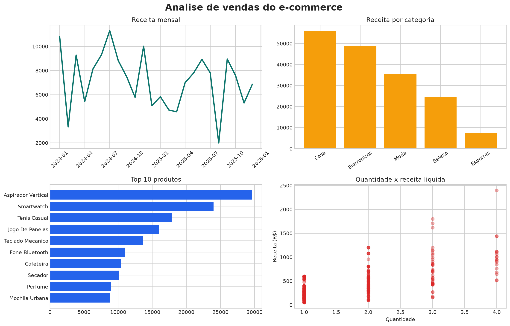

# Radar de Vendas

Dashboard de análise de vendas de e-commerce com pandas, NumPy, Matplotlib, Plotly e Streamlit.



## Execução

```bash
python -m pip install -r requirements.txt
python scripts/generate_dataset.py
streamlit run app.py
```

O dashboard inclui filtros por período, categoria e estado, KPIs, evolução mensal, ranking de produtos, análise regional, segmentação RFM e download dos dados tratados.